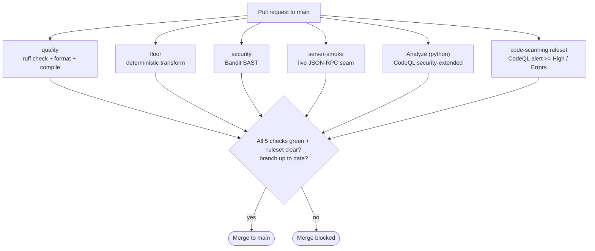
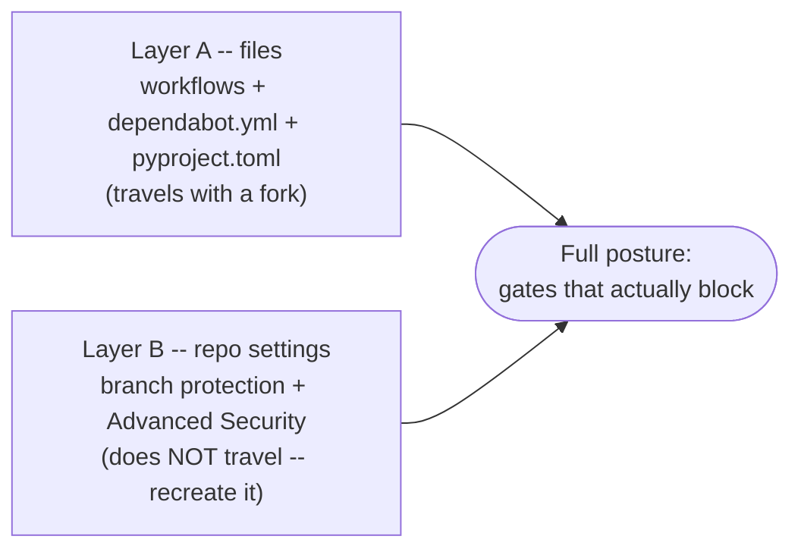
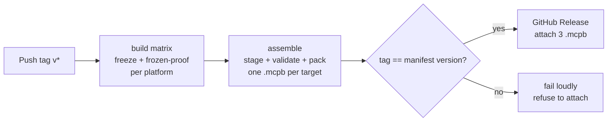

# CI/CD pipeline

This document describes the continuous-integration and continuous-delivery
chain of `agent-candidate`: what each piece does, how the protections fit
together, how acceptance is decided, and — importantly — **what travels with a
fork and what does not**.

It complements [`CONTRIBUTING.md`](CONTRIBUTING.md), which covers the
day-to-day contributor workflow (how to run the gates locally, the pull-request
flow, how to change the `candidate-suite` pin), and the
[`README`](README.md), which gives the project overview. This document is the
*why*; `CONTRIBUTING.md` is the *how*. Where they would overlap, this file
points there rather than repeating it.

`agent-candidate` is an MCP server frozen into a self-contained binary and
shipped as an `.mcpb` bundle. Two facts shape the whole chain and make it more
involved than a single-repo Python project:

1. **The real generators live in a second repository.** `candidate-suite` is
   consumed as a pinned sibling checkout, not a package — so the floor and the
   release must wire in an external, immutable source of truth (Sections 2, 6).
2. **The deliverable is a per-platform frozen binary.** Freeze integrity can
   only be proven by running the produced executable on each target OS, which
   adds a build-time proof tier the source gates cannot reach (Section 3).

---

## 1. Overview

The chain is a **gated pull-request flow**. Nothing reaches `main` except
through a pull request that passes every required gate. On top of the gates,
detection and maintenance features run continuously, and the release runs on a
version tag.

Three flows run outside the pull-request gate: detection features run
**continuously** (secret scanning + push protection, Dependabot), the
**pin watcher** runs **monthly** (Section 6), and the **release** runs on a
version tag (Sections 2–3).

The enforcement has **two layers**:

- **Layer A — files in the repository** (travel with a fork): the workflows,
  the Dependabot config, and the tooling configuration in `pyproject.toml`.
- **Layer B — repository settings** (do **not** travel with a fork): branch
  protection and the Advanced Security toggles.

Both layers are required for the full posture. A fork inherits Layer A by
copying the branch, but gets **none** of Layer B — until it is recreated, the
workflows still *run*, but nothing *blocks* a merge. Section 8 lists exactly
what a fork must reconfigure.

---

## 2. Workflows (Layer A — in `.github/workflows/`)

Seven workflows. The first five are the per-pull-request gates; `pin-watch`
runs on a schedule; `release` runs on a tag.

| Workflow | Trigger | Job (check name) | What it enforces |
|---|---|---|---|
| `ci.yml` | PR to `main`, push to `main` | `quality` | `ruff check` (lint) → `ruff format --check` → `python -m compileall server lab` |
| `floor.yml` | PR to `main`, push to `main` | `floor` | the deterministic floor: `python lab/test_chain_tools.py` against the **real, pinned** `candidate-suite` back-end, outside the agent loop |
| `security.yml` | PR to `main`, push to `main` | `security` | Bandit SAST: `bandit -c pyproject.toml -r .` over `server/` (`lab/` excluded via config) |
| `server-smoke.yml` | PR to `main`, push to `main` | `server-smoke` | live MCP server seam: `test_frozen_server.py --python-server` walks the JSON-RPC handshake (T0–T4) against the dev server |
| `codeql.yml` | PR to `main`, push to `main`, weekly (Mon 06:00 UTC) | `Analyze (python)` | CodeQL semantic analysis, `security-extended` query suite |
| `pin-watch.yml` | monthly (1st, 09:00 UTC), `workflow_dispatch` | `watch` | notifies (does not change) drift between the pinned `candidate-suite` SHA and its `HEAD` (Section 6) |
| `release.yml` | push of a tag `v*`, `workflow_dispatch` | `build`, `assemble` | freeze a binary per target + frozen-proof each, then stage/validate/pack one `.mcpb` per ship target and — on a tag only — attach them to the Release (Section 3) |

The release path, on a version tag:

Design notes:

- **Quality and security tools are pip-installed and version-pinned**
  (`ruff==0.15.16`, `bandit[toml]==1.9.4`) rather than run via a marketplace
  action. This keeps results deterministic and adds no extra GitHub Action to
  maintain — the same choice `candidate-suite` makes.
- **CodeQL uses advanced setup** (a committed workflow), not GitHub's "default
  setup". The two are mutually exclusive — do not enable default setup on top of
  this workflow. `security-extended` is chosen deliberately: it is broader than
  the default query suite, fitting for a security-sensitive MCP server. Python
  is interpreted, so there is no build step. The required-check context is
  reported as **`Analyze (python) (python)`** — the matrix `language` value is
  appended to the job name; this is the string to use in branch protection
  (read from the actual check run, not guessed).
- **The floor is a plain script, not pytest.** `test_chain_tools.py` has its own
  `main()`/`check()` and exits `0`/`1`, so it is invoked directly, not through
  `pytest`. It exercises the four tool-side defenses against the **real**
  `candidate-suite` scripts, **outside** the agent loop — no Claude API call, no
  tokens, so the job needs no API secret. (Mistaking it for a pytest suite was a
  porting trap; it is a script by design.)
- **Cross-repo wiring (new here — `candidate-suite`'s own CI has nothing like
  it).** `floor.yml`, `server-smoke.yml`, and `release.yml` each check out
  `candidate-suite` as a sibling, **pinned to a full immutable SHA**
  (`2863162e…`, the `v1.0.0` tip), and wire `CANDIDATE_SUITE_DIR`. The repo is
  public, so no token is needed. A pinned full SHA — not a tag — is what keeps a
  "deterministic floor" from drifting the day `candidate-suite` moves
  (Section 6). `actions/checkout` cannot fetch a short SHA, hence the full
  40-hex value.
- **`server-smoke` is a separate gate, not folded into `floor`.** A live MCP
  server is a distinct proof class: it exercises the event loop, stdio framing,
  call dispatch, and spawn-from-inside-the-server that neither the floor nor the
  frozen-build proof can reach by construction (neither has a live server). It
  is the regression guard for the "server-seam bug" class — e.g. the
  child-process stdin-inheritance bug that only reproduces on Windows. It runs
  in `--python-server` mode (the dev server, no PyInstaller build), so it stays
  mono-platform and cheap; the **frozen** server smoke (the real binary) is a
  per-platform, post-build gate in `release.yml`, not here.
- **The release matrix has a non-shipping canary.** `build` runs on four legs
  (`fail-fast: false`, so a red leg never cancels the others' verdicts):
  `windows-latest`/x64, `macos-14`/arm64, and `macos-15-intel`/x64 all **ship**;
  `ubuntu-latest`/x64 **builds but never ships** — there is no Claude Desktop on
  Linux, so a Linux `.mcpb` has no host. The canary is fail-fast portability and
  a 3.13 freeze check on the cheapest runner. (`macos-13` was retired in
  Dec 2025; the `macos-15-intel` label is supported through Fall 2027 — revisit
  then, since Apple has dropped x86_64.)
- **Permissions are least-privilege and time-shifted.** Every gate workflow is
  `contents: read`. `codeql.yml` adds `security-events: write` to upload
  results. In `release.yml`, `build` stays `read`; only the `assemble` job earns
  `contents: write`, and only its attach step uses it — and only on a tag.
  `workflow_dispatch` runs the whole matrix and a dry-run assembly (artifacts
  are uploaded, inspectable) **without** attaching anything, so the irreversible
  step is reachable only by pushing a tag.

---

## 3. Testing model and delivery acceptance

`candidate-suite` is deterministic: its acceptance reduces to "the pytest suite
passes (graded by how rich the environment is) plus a visual sample gallery".
`agent-candidate` adds a **model-driven** layer on top of that deterministic
core, which splits acceptance into two natures — **deterministic acceptance**
(CI gates decide) and **behavioral acceptance** (a live run that can *falsify*).
This section is the map of that proof ladder; it is the part of the chain with
the least in common with the source.

### 3.1 The automated tier (in CI)

The automated proofs are organized **per execution seam**, not per
environment-richness level. Each test proves a class of failure the others
cannot reach:

| Proof | Where it runs | What it proves | Seam it guards |
|---|---|---|---|
| **Floor** — `test_chain_tools.py` | `floor.yml`, every PR/push | the four tool-side defenses (ingestion strip, identifier tripwire, closing normalization, profile merge) hold against the **real** suite, outside the agent loop | transform logic — no API, no tokens |
| **Server smoke** — `test_frozen_server.py --python-server` | `server-smoke.yml`, every PR/push | T0 `initialize`, T1 `tools/list == single-source contract`, T2 in-server ingestion sanitiser, T3 self-re-exec → real `.md`, T4 refusal → `isError` over the wire | the **live server** (event loop, stdio framing, dispatch, spawn-from-inside) |
| **Frozen build proof** — `test_frozen_build.py` | `release.yml`, per platform, build time | the PyInstaller onedir is complete and the self-re-exec contract (`exit 0`/`1`/`2`, the 2800 ceiling) holds on the **real frozen executable** | freeze integrity; the 3.12→3.13 compat oracle for the pinned suite |
| **Frozen server proof** — `test_frozen_server.py <exe>` | `release.yml`, per platform, build time | the same T0–T4 handshake against the **frozen binary** on each target OS | the frozen server seam, including the Windows-only class |

One more test exists but is **local/dev-only**, run by no workflow:
`test_split_parity.py`. It guards the dev/ship split — `[S1]` the trust core
imports with no Agent SDK and no `mcp` pulled in, `[S2]` the ship seam
(`server.py`) exposes a **byte-identical** tool contract to the dev seam
(`build_tools`), `[S3]` the defenses behave on pure inputs, `[S4]` the cover
letter schema exposes its 14 required fields. Its load-bearing assertion —
`[S2]` ship == dev — is **independently enforced in CI** by Server Smoke's T1
(`tools/list` must equal the single-source contract) and by the release-time
parity assertion, so the contract cannot drift unnoticed even though the parity
script itself is not a gate.

**Coverage honesty.** The per-PR gates run on `ubuntu-latest`. That catches the
**OS-agnostic** server-seam regressions (contract drift, sanitiser, self-re-exec,
refusal). It does **not** catch the Windows-only class — the child-process
stdin-inheritance bug reproduces only on Windows; Linux tolerates it. Full
coverage is the per-platform **frozen** server proof in `release.yml`. This is a
deliberate shift-left arbitrage: the cheap Linux gate buys most of the
regression protection per PR (T1 alone — contract anti-drift — justifies it),
and the expensive per-platform proof runs at build time where it matters.

### 3.2 The behavioral tier (manual, above CI, by design)

Two proofs sit **above** the automated gates and are run by hand, because they
cannot be both cheap and honest in CI:

- **Live agent run** — a real model call exercising the full agent loop. This is
  the only proof that can **falsify** rather than merely confirm: it caught a
  schema defect in the `summary` generator (objects vs. strings) that the floor,
  by construction, could not see, because the floor proves transform logic, not
  the semantic meaning of real model-produced values. It is excluded from CI
  deliberately: it costs tokens and is non-deterministic.
- **Install-proof** — the frozen binary spawned and answering MCP **inside the
  host** (Claude Desktop), per platform. This is the end-user reality the
  frozen-server proof approximates but does not replace.

### 3.3 Delivery acceptance conditions

Three distinct bars, in order of strength:

1. **Green to merge** — all five required checks pass (`quality`, `floor`,
   `security`, `Analyze (python) (python)`, `server-smoke`) and the branch is up
   to date. This is the Layer B gate (Section 7). A CodeQL alert at or above the
   ruleset threshold (≥ High / Errors) **also** blocks the merge — enforced by
   the code-scanning ruleset, a gate distinct *in kind* from the five status
   checks: the checks gate on the job running, the ruleset gates on the finding
   (Section 7).
2. **Green to ship** — at a `v*` tag, every ship leg of the `build` matrix
   freezes and passes both frozen proofs, the `assemble` job packs one valid
   `.mcpb` per target, and the **`tag == manifest version`** guard holds before
   anything is attached. A mismatch fails loudly and attaches nothing.
3. **Installable** — the bundle installs and runs for an end user. **This is not
   implied by 1 or 2.** Today the one-click `.mcpb` install is blocked
   **upstream**, outside this repository (Section 9). The functional path is the
   documented manual host install in [`INSTALL.md`](INSTALL.md).

The honest headline a contributor must internalize: **a green CI is "merge-able"
and "ship-able", but not yet "one-click-installable".** That last bar is tracked
upstream, not here.

---

## 4. Tooling configuration (Layer A — `pyproject.toml`, single source of truth)

- **`[tool.ruff]` / `[tool.ruff.lint]`** — `target-version = "py313"`; rule set
  `E4`/`E7`/`E9`/`F` (pyflakes plus the import/statement/runtime subset of
  pycodestyle), so real problems are caught without cosmetic style noise.
  `E402` (import not at top of file) is ignored **on purpose**: the dev harness
  reconfigures `stdout`/`stderr` to UTF-8 **before** its imports — a settled
  Phase-1 decision, an organizational choice rather than a defect. Line length
  stays at ruff's default; `E501` is not selected, so embedded prose in tool
  descriptions is not flagged.
- **`[tool.bandit]`** — Bandit reads this when run with `-c pyproject.toml`
  (hence the `[toml]` extra). The skips are **deliberate, documented**
  exceptions, adapted from `candidate-suite`, not inherited blindly:
  - `B404` (import subprocess) — informational; `chain_core` invokes the real
    `candidate-suite` scripts as **child processes** (the proven process-boundary
    defense).
  - `B603` (subprocess without `shell=True`) — this is the **safe** form: every
    call is a fixed argument **list** with `shell=False`, the interpreter pinned
    via `sys.executable`, script paths resolved in full — no shell string, no
    user-controlled tokens.
  - The dangerous case, **`B602` (`shell=True`), stays active.**
  - **Deliberate divergence from `candidate-suite`:** that repo also skips
    `B607` (partial executable path); **this repo does not.** `agent-candidate`
    starts processes by **full** path (`sys.executable` + resolved script
    paths), so `B607` cannot fire — leaving it active costs nothing and removes a
    skip we do not need.
  - `exclude_dirs = ["lab"]` — the floor and harness in `lab/` are dev-only
    scaffolding that does not ship; the SAST scan targets `server/`, the code
    that ships.

**Runtime vs. build dependencies, both pinned.** Unlike `candidate-suite` (whose
Python deps are environment-provided and undeclared), this repo **declares** its
dependencies, split across two files:

- `requirements.txt` — runtime/floor deps (`claude-agent-sdk`, `mcp`,
  `python-docx`, `lxml`), pinned. End users never `pip install` these (the
  shipped binary is frozen); CI and the build do.
- `requirements-build.txt` — the freeze toolchain (`pyinstaller`,
  `pyinstaller-hooks-contrib`, `tzdata`), pinned and kept apart because it is
  needed to **produce** the payload, never to run the server.

Both are pinned for the same reason: a reproducible floor and a reproducible
binary. A silent `lxml` bump can break the C-extension build, so the bump must
arrive as a reviewable PR (Section 5), not silently.

---

## 5. Dependabot (Layer A — `.github/dependabot.yml`)

Two ecosystems, monthly, low-noise:

- **`github-actions`** — bumps the action tags pinned in `.github/workflows/`.
- **`pip`** — tracks `requirements.txt`. This is the divergence from
  `candidate-suite` (which has no Python manifest, so `github-actions` only).
  Here it matters: a silent `lxml`/`python-docx` bump can break the frozen
  binary, so we want it as a reviewable PR, not a surprise.

Important distinction: the monthly cadence governs **version updates**.
**Security updates** (vulnerability-driven fixes) are immediate and controlled by
a repository-settings toggle (Layer B), independent of the schedule.

Note what Dependabot **does not** track: the `candidate-suite` pin. That is a
full SHA passed as a `ref:` to `actions/checkout`, and neither ecosystem follows
it — by design (Section 6).

---

## 6. The `candidate-suite` pin and its drift watcher (Layer A)

`candidate-suite` is consumed not as a package but as a **second
`actions/checkout` pinned to a full immutable SHA** (`2863162e…`) in `floor.yml`,
`server-smoke.yml`, and `release.yml`. It is an **immutability anchor** — a
reproducible floor and a reproducible bundle — **not** a freshness target.

Two consequences follow, and they are intentional:

- **Dependabot must not track it.** Its model ("always propose the latest")
  would silently move the floor's source of truth. The anchor exists precisely
  to *not* move on its own.
- **The SHA that tests must be the SHA that ships.** The same pin feeds the floor
  (which proves the real scripts run), the server smoke (which exercises the real
  refusal contract over the wire), and the bundle staging (which copies the same
  tree beside the binary). "Ship == proven" depends on these being one value.

So drift is handled by **notification, not automation**. `pin-watch.yml` runs
monthly: it derives the pinned SHA **from `floor.yml`** (never re-typed — the
invariant is that the only 40-hex SHA in that file is the pin; more than one
match fails loudly), resolves `candidate-suite` `HEAD` over the git protocol
(not the rate-limited REST API), and, if `HEAD` is **ahead**, opens **one**
idempotent issue (labelled `pin-drift`, deduplicated by label, not title). The
issue body lists the new commits and points at the manual flow.

The loop is deliberately human at the decision point:

- **Awareness** — the watcher opens the issue.
- **Validation** — the `floor` gate replays the **real** scripts at any candidate
  SHA before merge.
- **Decision** — a maintainer bumps the pin **in a PR**, per
  [`CONTRIBUTING.md` → "Changing the `candidate-suite` pin"](CONTRIBUTING.md)
  (full SHA, never a mutable ref; `floor.yml`, `server-smoke.yml`, and
  `release.yml` in one PR).

---

## 7. Repository settings (Layer B — NOT in files, do not travel with a fork)

These are configured in the GitHub UI and must be recreated in any fork that
wants the same protection.

**Branch protection on `main`** (Settings → Branches / Rules):

- Require a pull request before merging.
- Require these status checks to pass: **`quality`**, **`floor`**,
  **`security`**, **`Analyze (python) (python)`**, **`server-smoke`**.
- Require branches to be up to date before merging (`strict`).
- Block force pushes; restrict deletions; **do not allow bypassing, admins
  included** (`enforce_admins`).

**Code-scanning merge protection — enforced (ruleset).**
A repository ruleset (Settings → Rules → Rulesets), **`Code scanning - CodeQL
gate`**, blocks a merge when CodeQL reports an alert at or above a severity
threshold — at parity with `candidate-suite`. It targets the default branch, has
**no bypass actors (admins included)**, and carries one `code_scanning` rule:
tool **CodeQL**, `security_alerts_threshold: high_or_higher`, `alerts_threshold:
errors`. This closes a gap worth stating plainly, because the two mechanisms
differ *in kind*: the `Analyze (python) (python)` required **status check**
proves the analysis **ran** (and blocks if it fails to run), but it stays green
while merely uploading an alert to code scanning; the **ruleset** reads the
analysis *results* and blocks the merge if a security alert is High or above, or
a quality alert is at error level. The status check gates on the **job**; the
ruleset gates on the **finding**. (Classic branch protection's required-checks
list cannot express this — there is no built-in check that means "no High
alert"; the code-scanning gate is a ruleset-only rule type.)

**Advanced Security** (Settings → Advanced Security / Code security):

- CodeQL — recognized as advanced setup once `codeql.yml` has run. Do not also
  enable CodeQL default setup.
- **Secret scanning** + **push protection** — on (a pushed secret is blocked at
  push time).
- **Dependabot alerts** + **security updates** — on (this is the immediate,
  vulnerability-driven channel from Section 5).
- Default workflow token is **read-only**, and GitHub Actions may **not** create
  or approve pull requests.

---

## 8. Forking your own version

A fork copies the default branch and therefore **all of Layer A** (workflows,
Dependabot config, tooling configuration). It copies **none of Layer B**. To get
the same posture in your fork:

1. **Enable Actions.** GitHub disables workflows on new forks. Go to the
   **Actions** tab and enable them.
2. **Public vs private fork.** Code scanning (CodeQL), secret scanning, and push
   protection are **free on public repositories**. On a **private** fork they
   require GitHub's paid code-security features.
3. **Enable Advanced Security features** (Section 7): secret scanning + push
   protection, and Dependabot alerts + security updates. CodeQL is picked up
   automatically from `codeql.yml` on the first run.
4. **Recreate branch protection** on your default branch with the five required
   checks and "require branches up to date" (Section 7).
5. **Recreate the code-scanning ruleset** (CodeQL, ≥ High / Errors) so alerts
   block merges, mirroring `agent-candidate`'s `Code scanning - CodeQL gate`
   (Section 7). Like all of Layer B, it does not travel with a fork.
6. **The `candidate-suite` pin already travels** (it is in Layer A files). The
   sibling repo is public, so the pinned checkout needs no token. If you also
   fork `candidate-suite`, repoint the pin in `floor.yml`, `server-smoke.yml`,
   and `release.yml` to your fork's SHA — in one PR (Section 6).

Until steps 3–4 are done, the workflows will still **run** (and you can read
their results), but nothing **blocks** a merge — the blocking comes from
Layer B.

---

## 9. Security posture summary (defense in depth)

| Control | Layer | Blocks |
|---|---|---|
| `quality` required check | B (branch) | broken lint / format / compile |
| `floor` required check | B (branch) | a broken tool-side defense or transform |
| `security` required check | B (branch) | a Bandit finding |
| `server-smoke` required check | B (branch) | a server-seam regression (contract drift, sanitiser, refusal) |
| `Analyze (python) (python)` required check | B (branch) | a CodeQL analysis failure (the analysis failing to run — **not** an alert) |
| `Code scanning - CodeQL gate` ruleset (CodeQL ≥ High / Errors) | B (ruleset) | a CodeQL alert at or above threshold (the *finding*, not the run) |
| Secret scanning + push protection | B (Adv. Security) | a secret at push time |
| Dependabot alerts / security updates | B (Adv. Security) | a vulnerable dependency (alerts; auto-fix PRs) |
| `tag == manifest version` guard | A (`release.yml`) | attaching a version-mismatched bundle |
| Dependabot version updates | A (`dependabot.yml`) | stale action / dependency versions |

A few caveats worth knowing:

- **CodeQL alerts block merges via the ruleset, not the status check.** The
  `Analyze (python) (python)` check proves the analysis ran, not that it was
  clean; the gating on *findings* comes from the `Code scanning - CodeQL gate`
  ruleset (alert ≥ High / Errors), now at parity with `candidate-suite`
  (Section 7). Status check = the job ran; ruleset = the result passes.
- **`release.yml` is only exercised on a tag push or a dispatch.** A pull
  request's gates do not run it, so a green PR does not prove the release still
  works. Validate the release path on the next `v*` tag (or via
  `workflow_dispatch` for a dry run, which builds and packs but attaches
  nothing).
- **Action pins are floating majors** (e.g. `@v5`/`@v6`); Dependabot proposes
  bumps when a new major ships — review the compatibility notes before merging.
  The **one** SHA pin in the repo is `candidate-suite` (Section 6); it is the
  anchor, intentionally not floating.
- **Server-seam coverage is asymmetric.** The per-PR `server-smoke` gate
  (Linux) catches OS-agnostic regressions; the Windows-only class is caught only
  by the per-platform frozen proof in `release.yml`. This is a knowing
  shift-left trade-off (Section 3.1).
- **Known limitation — one-click install is blocked upstream.** The
  `server.type: binary` `.mcpb` does not yet install in one click on the tested
  host: a host-side "basic execution" path fails to spawn a binary server
  (tracked upstream as `modelcontextprotocol/mcpb#282`), and a separate
  signing/packaging defect on the signed path was reclassified as an upstream
  tooling bug, fixed there but pending a CLI release
  (`modelcontextprotocol/mcpb#278`). Both are **outside this repository** and do
  not affect the proven-healthy binary. The supported path today is the manual
  host install documented in [`INSTALL.md`](INSTALL.md); the deeper rationale
  lives in the project's private steering notes.
