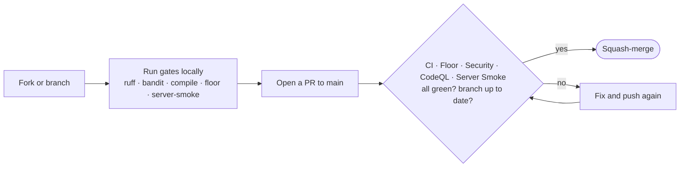

# Contributing

Thanks for your interest in `agent-candidate`. This repository ships a single
**standalone stdio MCP server** (`server/`) that is frozen into a self-contained
binary and distributed as platform `.mcpb` bundles. Its Python dependencies are
**declared and pinned** in [`requirements.txt`](requirements.txt) (runtime +
floor) and [`requirements-build.txt`](requirements-build.txt) (build-only
toolchain) — unlike `candidate-suite`, which relies on packages provided by the
Claude execution environment and declares none.

The deterministic floor additionally needs the real `candidate-suite` scripts,
checked out **at a pinned, immutable SHA** and located through the
`CANDIDATE_SUITE_DIR` environment variable (see Prerequisites). That pin is a
determinism anchor, not a dependency to keep fresh: it is moved deliberately, by
a reviewed pull request, never automatically.

This guide is for two audiences:

- **Contributors** who want to propose a change via a pull request (you do not
  need to be an administrator of the repository).
- **Forkers** who want to run their own version. Note that some protections
  **live in files and travel with a fork** (the workflow definitions, the
  `pyproject.toml` toolchain config, the pinned `requirements*.txt`), while
  others **live in repository settings and do not** (branch protection on
  `main`, required-check enforcement, the security/code-scanning configuration).
  After forking you must re-create the settings-side protections yourself.

## Ground rules

`main` is protected. **You cannot push to it directly.** Every change lands
through a pull request that must pass the required checks before it can be
merged. As a non-administrator you cannot bypass these checks, change branch
protection, or alter repository settings — that is by design.

## Prerequisites

- **Python 3.13** (the version CI runs and the binary is frozen with).
- The two quality/security tools, **pinned to the exact CI versions** so your
  local result matches CI:

```bash
python -m pip install "ruff==0.15.16" "bandit[toml]==1.9.4"
```

- The runtime / floor dependencies:

```bash
python -m pip install -r requirements.txt
```

- The `candidate-suite` scripts the floor exercises, pinned to the SHA CI uses,
  checked out **next to** your `agent-candidate` clone and wired through
  `CANDIDATE_SUITE_DIR`:

```bash
git clone https://github.com/David-BS/candidate-suite.git
git -C candidate-suite checkout 2863162ee8bdb6260dd6d0c99621115a5b89cb6a
export CANDIDATE_SUITE_DIR="$(pwd)/candidate-suite"
```

A virtual environment is recommended but not required.

## Reproduce the gates locally (before you push)

Run the same checks CI runs, from the repository root. If they pass locally,
your pull request will go green on the first try.

```bash
ruff check .                              # lint
ruff format --check .                     # formatting (does not modify files)
python -m compileall -q server lab        # every module must byte-compile
bandit -c pyproject.toml -r .             # security scan (SAST); lab/ excluded via config
python lab/test_chain_tools.py            # deterministic floor (exit 0/1) — needs CANDIDATE_SUITE_DIR
python lab/test_frozen_server.py --python-server   # live stdio-server boot/handshake (dev server)
```

Notes:

- `ruff format --check .` only reports; to apply formatting run `ruff format .`.
- `ruff` scans the whole repository; `bandit` reads its config from
  `pyproject.toml` and **excludes `lab/`** (dev-only scaffolding that does not
  ship). The deliberate, documented Bandit skips (`B404`, `B603`) and the kept
  `B602`/`B607` are explained in that config.
- The **floor** is a plain script (exit 0/1), not pytest. It re-proves the
  deterministic defenses (ingestion strip, identifier tripwire, closing
  normalization) against the real `candidate-suite` scripts; it needs
  `CANDIDATE_SUITE_DIR` set (above).
- **Server Smoke** in `--python-server` mode boots the dev server and walks the
  JSON-RPC handshake (`initialize` / `tools/list` / `tools/call`), the
  regression guard for the server seam the floor cannot reach. It also needs
  `CANDIDATE_SUITE_DIR`. (The frozen-binary proofs, `test_frozen_build.py` and
  the non-`--python-server` mode of `test_frozen_server.py`, require a built
  binary and run at build time, not as a per-PR local gate.)
- **CodeQL** runs in CI only; there is no local step to reproduce it.

## Pull request workflow



1. **Fork** the repository (or, if you have write access, create a branch).
2. Create a topic branch, e.g. `git checkout -b fix/short-description`.
3. Make your change and run the gates locally (above).
4. Commit and push your branch, then open a pull request targeting `main`.
5. Wait for the required checks to pass:
   - **`CI`** — ruff lint + format check + compile sweep.
   - **`Floor`** — the deterministic floor suite against the pinned scripts.
   - **`Security`** — Bandit security scan of `server/`.
   - **`CodeQL`** — semantic security analysis (surfaces as `Analyze (python)`).
   - **`Server Smoke`** — live stdio MCP server boot/handshake.
6. Your branch must be **up to date with `main`** before merging (rebase or merge
   `main` in if it has moved).
7. A merge is also blocked if CodeQL reports a code-scanning alert at or above
   the configured threshold.

## Changing the `candidate-suite` pin

The floor and the release build pin `candidate-suite` at a full, immutable SHA.
To move it: update the `ref:` in `.github/workflows/floor.yml` **and**
`.github/workflows/release.yml` to the new full SHA in a single pull request, and
let the `Floor` gate re-prove the deterministic defenses on the new scripts. Use
the **full** 40-character SHA (`actions/checkout` cannot fetch a short SHA).
Never move the pin to a mutable ref (a branch name); the anchor must stay
immutable.

## Commit conventions

- Use a short, conventional prefix: `ci:`, `deps:`, `docs:`, `fix:`, `feat:`,
  `chore:` (Dependabot uses `ci:` for action bumps and `deps:` for Python ones).
- Keep one family of changes per pull request; documentation accompanies the
  change it describes.
- Consider committing with a GitHub `noreply` email to avoid leaking a real
  address in public history.

## What not to commit

- **No personal data.** Names, addresses, real CVs, real company names — all
  fixtures and examples must be fictional.
- **No build artifacts.** The PyInstaller `build/` and `dist/` outputs and the
  `*.mcpb` bundles are git-ignored; the `release` workflow builds and publishes
  them.
- **No run records.** The `runs/` directory (run-record JSONL) is git-ignored.
- **Not the `candidate-suite` checkout.** It is fetched as a separate, pinned
  checkout; it must never be vendored into this repository.
